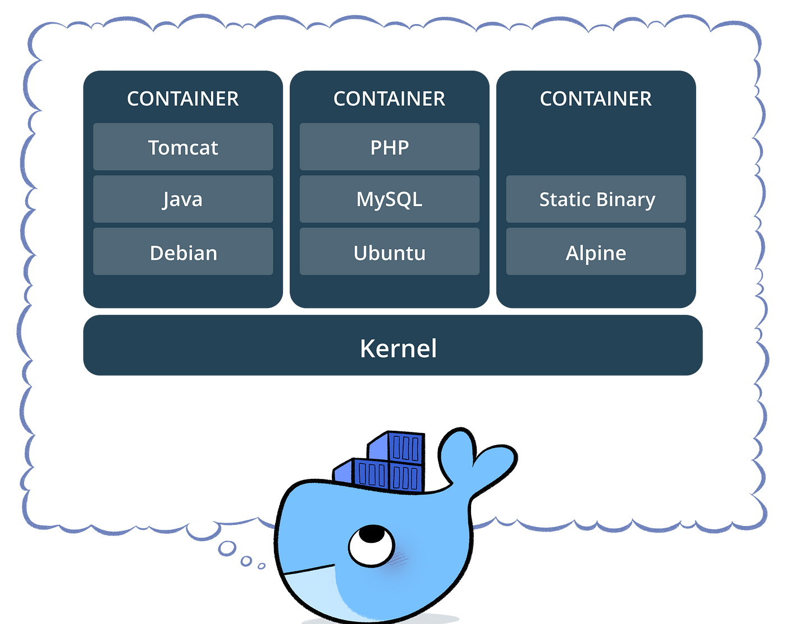
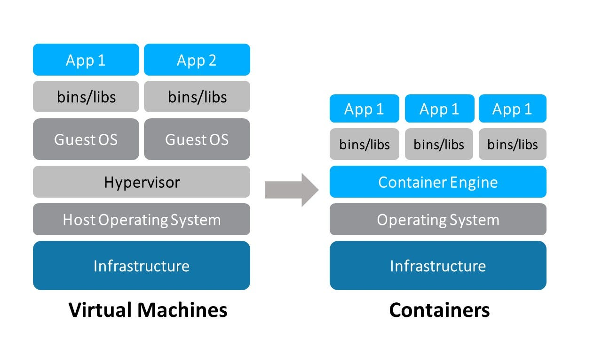
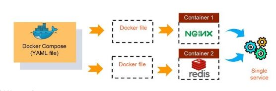

# Inception, in what consists?
Inception is a project part of the 42 Common Core that aims to learn how to use Docker and Docker Compose to create multiple containers/services that work together and without the help of DockerHub, except for the linux images. So you will have to create your own images and use them in your containers.

## What is Docker?
Docker is a platform that **allows you to develop, ship, and run applications in containers**. Containers are lightweight, standalone, and executable packages of software that include everything needed to run an application: code, runtime, system tools, system libraries, and settings.

<div align="center">
  
</div>

### So... If Docker is that, what is the difference between Docker and a Virtual Machine?
The main difference between a container and a virtual machine is that a container shares the host system's kernel with other containers. This means that it is much more lightweight and faster than a virtual machine, which has its own kernel and requires more resources to run. But of course, you can have a Virtual Machine and inside it, you can have Docker running.

<div align="center">
   
</div>

In summary, Docker helps to solve the TIPICAL problem of **"It works on my machine"**. With Docker, you can create a container with all the dependencies and configurations needed to run your application, and then share it with others. This way, you can be sure that your application will run the same way on any machine that has Docker installed.
<div align="center">
   
</div>

## What is Docker Compose?
Docker Compose is a tool that allows you to define and run **multi-container Docker applications**. With Compose, you use a YAML file(docker-compose.yml) to configure your application's services, networks, and volumes. Then, with a single command, you create and start all the services from your configuration. For simplify the process of the command you can check the `Makefile` that I created.

<div align="center">
   
</div>

## How can we connect the containers?
To connect the containers, we can use the **networks** that Docker provides. A network is a group of containers that can communicate with each other. By default, containers are connected to the default bridge network, but you can create custom networks to isolate containers and control how they communicate. In this project, I created a custom network called `inception` to connect all the containers. You can see how I did it in the `docker-compose.yml` file.

In this way, Nginx can access to the WordPress container, and the WordPress container can access to the MariaDB container. Also, the Redis container can access to the WordPress container...

## What is a volume?
A volume is a **persistent data storage** mechanism that allows you to store and share data between containers. Volumes are used to persist data generated by and used by Docker containers. They are stored on the host system(your pc or a server) and can be shared between containers. In this project, I created a volume called `wp_data` to store the WordPress data and a volume called `db_data` to store the MariaDB data. You can see how I did it in the `docker-compose.yml` file.

## Containers created
- [Nginx](https://nginx.com/): used as a reverse proxy to serve the WordPress and the static website. A reverse proxy is a server that sits between clients and backend servers and forwards client requests to the appropriate backend server. It also serves as a load balancer, distributing client requests across multiple servers. It's used to improve performance, security, and scalability. Similar to Apache but with better performance and simpler configuration.
- [WordPress](https://wordpress.org/): a popular content management system (CMS) that allows you to create and manage websites without needing to write code. It's built on PHP and uses a MySQL database to store content. WordPress is highly customizable and has a large ecosystem of themes and plugins that extend its functionality.
- [MariaDB](https://mariadb.org/): A relational database that is the same as MySQL, but it's a fork of MySQL that is developed and maintained by the community. It's open-source and free to use, and it's designed to be a drop-in replacement for MySQL. MariaDB is known for its performance, scalability, and security features.

## Bonus Containers created
- **Redis**: an in-memory data store that is used for caching and session storage. It's known for its speed and scalability, making it ideal for applications that require fast access to data. Redis is often used to improve the performance of web applications in backend services, such as caching frequently accessed data or storing session information.
- **FTP server(vsfptd)**: a lightweight and secure FTP server that allows you to transfer files between your local machine and the server. FTP is a standard network protocol used for transferring files over the internet. vsftpd is known for its security features and performance, making it a popular choice for hosting files on a server. In this project, we connected with the /var/www/html/ folder of the volume of Wordpress to be able to manipulate the files of the website.
- **Adminer**: the same as PHPMyAdmin, but it's a single PHP file that allows you to manage databases through a web interface. It's lightweight and easy to use, making it a popular choice for developers who need to interact with databases without installing a full-featured database management tool.
- **Watchtower**: this is the service that I choose to incorporate in the project because in the real world it's so helpful. It's a container that automatically updates other containers when a new image is available. It monitors the Docker Hub(here we can't use DockerHub, but in real world, this is insanely useful) registry for changes to the images used by other containers and updates them automatically. This helps to keep your containers up to date with the latest security patches and bug fixes.
- Serve a static website with language of your choice (except PHP), in my case with express.js.

### Verify the functionality of the containers

#### Verify Nginx Functionality

##### 1. **Access the Nginx Server**:
   - Open a web browser and navigate to `https://localhost`.
   - You should see the Wordpress site served by Nginx.

#### Verify WordPress Functionality

##### 1. **Access the WordPress Site**:
   - Open a web browser and navigate to `https://localhost/wp-admin`.
   - You should see the WordPress login page.

##### 2. **Log in to the WordPress Admin Dashboard**:
   - Use the following credentials to log in to the WordPress admin panel:
      - **Username or Email**: `user that you put it in the .env file`
      - **Password**: `password that you put it in the .env file`
   - After logging in, you should see the WordPress admin dashboard.

##### 3. **Create a New Post or Page**:
   - From the WordPress admin dashboard, create a new post or page.
   - Add some content and publish the post or page.

##### 4. **View the Post or Page on the Frontend**:
   - After publishing the post or page, view it on the frontend of the WordPress site.
   - Navigate to the homepage or the post/page URL to see the content you created.

#### Verify MariaDB and Adminer Functionality

##### 1. **Access the MariaDB Database**:
   - Use a database management tool such as Adminer to access the MariaDB database.
   - Open a web browser and navigate to `https://localhost/adminer.php`.
   - Use the following credentials to log in to the MariaDB database:
     - **Server**: `server that you put it in the .env file`
     - **Username**: `user that you put it in the .env file`
     - **Password**: `password that you put it in the .env file`
     - **Database**: `database that you put it in the .env file`
   - Click on **"Login"** to access the database.

##### 2. **View the WordPress Tables**:
   - After logging in to the MariaDB database, you should see the WordPress tables.
   - You can view the tables and data stored in the database.

#### Verify Static Website Functionality

##### 1. **Access the Static Website**:
   - Open a web browser and navigate to `http://localhost:3000`.
   - You should see the static website served by the Express.js server.

#### Verify Redis Functionality

##### 1. Check the Redis Object Cache Plugin Status in WordPress

1. **Access the WordPress Admin Dashboard**:
   - Log in to your WordPress admin panel (`http://<your_domain>/wp-admin`).

2. **Navigate to the Plugins Section**:
   - Go to **"Plugins"** and find the **"Redis Object Cache"** plugin.

3. **Review the Plugin Status**:
   - Click on **"Settings"** below the Redis Object Cache plugin.
   - Verify the Redis connection status:
     - **Status**: Should indicate "Enabled".
     - **Filesystem**: Should be "Writeable".
     - **Redis**: Should indicate "Reachable" and should not show connection errors.

##### 2. Check Redis from Within the Redis Container

1. **Access the Redis Container**:
   - Run the following command to enter the Redis container:
     ```bash
     docker exec -it redis sh
     ```

2. **Use `redis-cli` to Check Redis**:
   - Once inside the container, execute the following command to access the Redis command-line interface:
     ```bash
     redis-cli
     ```

3. **Check Redis Keys**:
   - Run the following command to list all keys in Redis:
     ```bash
     keys '*'
     ```
   - This will show all the keys stored in Redis. If you see relevant keys for your WordPress application, it means Redis is functioning and being used for caching.

4. **Exit Redis CLI and the Container**:
   - Exit the Redis CLI with the command:
     ```bash
     exit
     ```
   - Then, exit the Redis container with the command:
     ```bash
     exit
     ```

- **If Redis is not functioning as expected**, check the Redis configuration in the `redis.conf` file and ensure it is correctly set up to accept connections from WordPress.
- **Review the logs of the Redis container** if you encounter issues while running the commands. You can do this with the following command:
  ```bash
  docker logs redis
  ```

#### Verify FTP Server(vsftpd) Functionality

##### 1. **Access the FTP Server with FileZilla or Another FTP Client**:
   - Use an FTP client such as [FileZilla](https://filezilla-project.org/) to connect to the FTP server.
   - Enter the following details:
     - **Host**: `localhost`
     - **Port**: `21`
     - **Protocol**: `FTP`
     - **User**: `user that you put it in the .env file`
     - **Password**: `password that you put it in the .env file`
   - Click on **"Quickconnect"** to connect to the FTP server.

##### 2. **Transfer Files to the FTP Server**:
   - Once connected, you can transfer files between your local machine and the server.
   - You can upload files to the `/var/www/html/` directory, which is the root directory of the WordPress site.

##### 3. **Verify File Transfer**:
   - After transferring files, you can verify that they are accessible from the WordPress site.
   - Access the WordPress site in a web browser and check if the files are displayed correctly.

##### 4. **Disconnect from the FTP Server**:
   - Once you have finished transferring files, you can disconnect from the FTP server using the FTP client.

#### Verify Watchtower Functionality
   
##### 1. **Check the Watchtower Logs**:
   - Run the following command to check the logs of the Watchtower container:
     ```bash
     docker logs watchtower
     ```
   - This will show the logs of the Watchtower container, including any updates it has performed.
